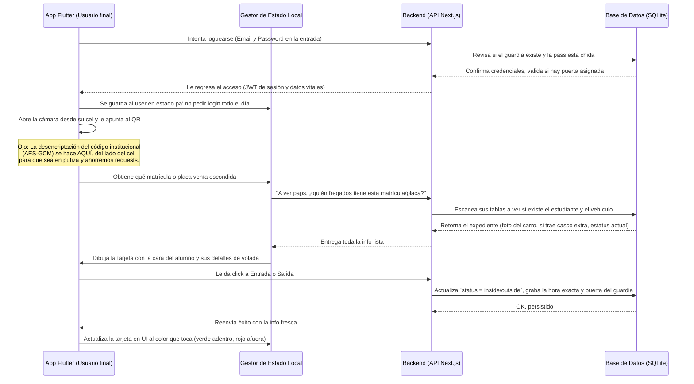

```mermaid
sequenceDiagram
    participant Guardia as App Flutter (Usuario final)
    participant Riverpod as Gestor de Estado Local
    participant Backend as Backend (API Next.js)
    participant DB as Base de Datos (SQLite)

    %% Autenticación: Cuando apenas empieza su turno
    Guardia->>Backend: Intenta loguearse (Email y Password en la entrada)
    Backend->>DB: Revisa si el guardia existe y la pass está chida
    DB-->>Backend: Confirma credenciales, valida si hay puerta asignada
    Backend-->>Guardia: Le regresa el acceso (JWT de sesión y datos vitales)
    Guardia->>Riverpod: Se guarda al user en estado pa' no pedir login todo el día

    %% Lectura de QR: Viene el alumno con prisa
    Guardia->>Guardia: Abre la cámara desde su cel y le apunta al QR
    Note over Guardia: Ojo: La desencriptación del código institucional <br/>(AES-GCM) se hace AQUÍ, del lado del cel, <br/>para que sea en putiza y ahorremos requests.
    Guardia->>Riverpod: Obtiene qué matrícula o placa venía escondida
    Riverpod->>Backend: "A ver paps, ¿quién fregados tiene esta matrícula/placa?"
    Backend->>DB: Escanea sus tablas a ver si existe el estudiante y el vehículo
    DB-->>Backend: Retorna el expediente (foto del carro, si trae casco extra, estatus actual)
    Backend-->>Riverpod: Entrega toda la info lista
    Riverpod->>Guardia: Dibuja la tarjeta con la cara del alumno y sus detalles de volada

    %% Registro de Acceso: Picar "Adentro/Afuera"
    Guardia->>Backend: Le da click a Entrada o Salida
    Backend->>DB: Actualiza `status = inside/outside`, graba la hora exacta y puerta del guardia
    DB-->>Backend: OK, persistido
    Backend-->>Guardia: Reenvía éxito con la info fresca
    Guardia->>Riverpod: Actualiza la tarjeta en UI al color que toca (verde adentro, rojo afuera)
```